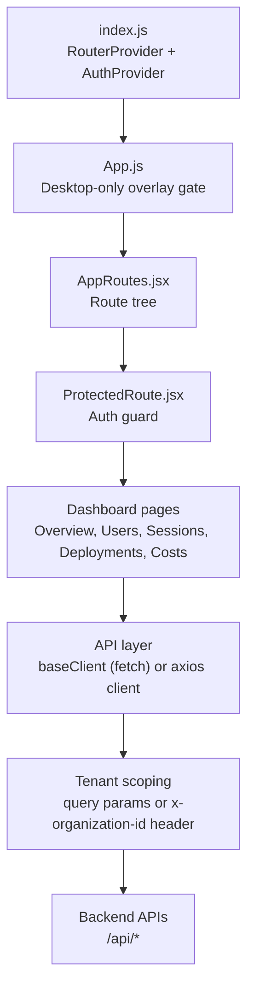
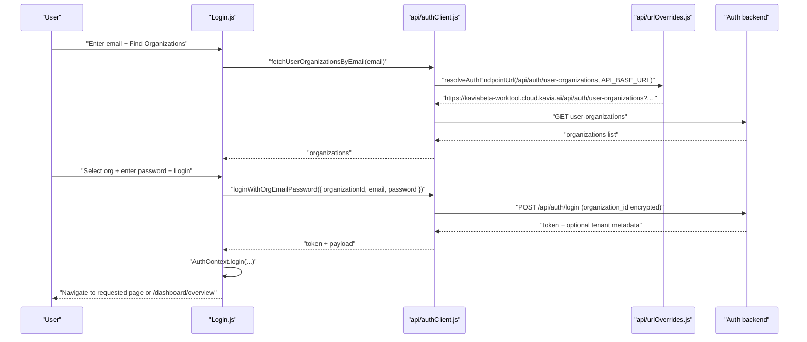

# Tenant-Aware Analytics Dashboard (React) — Architecture

## System context

This repository contains the frontend for a tenant-aware analytics dashboard implemented as a React single-page application (SPA). The frontend depends on external backend HTTP APIs for authentication, tenant discovery/selection, and analytics data.

At runtime, the SPA is delivered by the React build (CRA) and makes outbound calls to backend endpoints under `/api/*`. During local development, CRA’s proxy forwards `/api` and `/openapi.json` to a configured backend target.

Evidence:
- CRA proxy configuration: `mongodb_dashboard_frontend/src/setupProxy.js`.
- Route tree and guarded dashboard routes: `mongodb_dashboard_frontend/src/routes/AppRoutes.jsx`.

## High-level architecture

### Main runtime building blocks

1. **React SPA shell**
   - Entry: `mongodb_dashboard_frontend/src/index.js` creates a data router and renders `<App />` under `<AuthProvider />`.
   - Theming: `setTheme("dark")` is applied at startup.

2. **Routing layer**
   - `AppRoutes` defines public `/login` and guarded `/dashboard/*` routes, using React Router v6 `Routes` and `Route`.

3. **Authentication state**
   - `AuthContext` stores and exposes an `isAuthenticated` flag and login/logout methods.
   - Authentication state is primarily backed by localStorage under the `auth` key.

4. **Tenant selection and bootstrap**
   - `TenantBootstrap` is an effect-only component intended to run on entering protected routes to ensure an active tenant is selected.
   - `TenantSelection` page allows the user to select a tenant when multiple tenants exist.

5. **API access layer**
   - Two distinct HTTP client implementations exist:
     - A **fetch-based** client in `src/api/baseClient.js` with centralized scoping rules.
     - A **minimal axios instance** in `src/api/client.js` using base URL from `src/api/config.js`.
   - Tenant scoping helpers exist in `src/api/tenantScope.js`.

6. **Layout and navigation**
   - `AppLayout` composes `Topbar`, `Sidebar`, and a content region, using a fixed layout.
   - Sidebar shows Costs only for super-admin (`T0000`).

Evidence:
- Shell: `mongodb_dashboard_frontend/src/App.js`, `mongodb_dashboard_frontend/src/components/layout/AppLayout.jsx`.
- Layout: `mongodb_dashboard_frontend/src/components/layout/Sidebar.jsx`, `mongodb_dashboard_frontend/src/components/layout/Topbar.jsx`.
- API client: `mongodb_dashboard_frontend/src/api/baseClient.js`, `mongodb_dashboard_frontend/src/api/client.js`.

## Key runtime flows

### Flow A: Application start and desktop-only gating

The root component `App` blocks the UI for non-desktop viewports (width < 1024px) by rendering a modal-like overlay instead of routes.

Evidence:
- `useIsBelowDesktopBreakpoint(1024)` and early return of `<DesktopOnlyOverlay />` in `mongodb_dashboard_frontend/src/App.js`.

### Flow B: Auth-gated routing

`AppRoutes` wraps dashboard routes in `ProtectedRoute`. `ProtectedRoute` checks `useAuth().isAuthenticated` and redirects unauthenticated users to `/login` while preserving the requested route in location state.

Evidence:
- `ProtectedRoute`: `mongodb_dashboard_frontend/src/components/common/ProtectedRoute.jsx`.
- Route wrapper: `mongodb_dashboard_frontend/src/routes/AppRoutes.jsx`.

### Flow C: Login with organization discovery

The login page performs a two-step process:
1. The user enters an email and triggers organization discovery by calling:
   - `fetchUserOrganizationsByEmail(email)` -> GET `/api/auth/user-organizations?email=...`
2. The user selects an organization and enters a password, then logs in via:
   - `loginWithOrgEmailPassword({ organizationId, email, password })` -> POST `/api/auth/login`

Notably, `resolveAuthEndpointUrl` forces these auth endpoints to an external domain (`https://kaviabeta-worktool.cloud.kavia.ai`) regardless of the base URL configured for other API calls.

Evidence:
- Login page orchestration: `mongodb_dashboard_frontend/src/pages/Login.js`.
- Auth client: `mongodb_dashboard_frontend/src/api/authClient.js`.
- Auth URL override: `mongodb_dashboard_frontend/src/api/urlOverrides.js`.

### Flow D: Tenant bootstrap and selection

The repository includes a tenant bootstrap mechanism that uses cookie-based endpoints for listing and selecting tenants:
- GET `/api/session/tenants` (credentials included)
- POST `/api/tenants/select` (credentials included)

`TenantBootstrap` uses localStorage to detect whether an active tenant is present. If none is present, it fetches tenants and:
- auto-selects if only one tenant exists, or
- navigates to `/tenant/select` for multi-tenant selection.

Evidence:
- `TenantBootstrap`: `mongodb_dashboard_frontend/src/components/TenantBootstrap.jsx`.
- Tenant client: `mongodb_dashboard_frontend/src/utils/tenantClient.js`.
- Tenant selection page: `mongodb_dashboard_frontend/src/pages/TenantSelection.jsx`.

Important architectural note: `TenantBootstrapGate` exists but is not wired into the route tree shown in `AppRoutes.jsx`, and `TenantBootstrap` is not directly mounted in `AppRoutes.jsx` in the code reviewed. As a result, tenant bootstrapping may rely on other page-level mounting not verified in this read set.

Evidence:
- Gate component: `mongodb_dashboard_frontend/src/components/common/TenantBootstrapGate.jsx`.
- No usage in `mongodb_dashboard_frontend/src/routes/AppRoutes.jsx`.

### Flow E: Tenant scoping of data calls

The codebase implements tenant scoping in multiple ways depending on endpoint:

1. **Authorization header**
   - `buildAuthHeaders` attaches `Authorization: Bearer <token>` if a token exists.
   - It explicitly does not attach a tenant header by default.

Evidence:
- `buildAuthHeaders` in `mongodb_dashboard_frontend/src/api/authTokenProvider.js`.

2. **Query-param scoping in baseClient**
   - For `/api/users` root and `/api/users/tenant-summary`, `baseClient` enforces a strict query shape: it sends only `organization_id` from storage.
   - For `/api/session-tracking` list endpoints, it appends `tenant_id` from storage and strips `organization_id`.

Evidence:
- `sanitizeEndpointParams` and `ensureScopedQueryParams` in `mongodb_dashboard_frontend/src/api/baseClient.js`.
- `listUsers` and `listSessions` in `mongodb_dashboard_frontend/src/api/baseClient.js`.

3. **Header scoping for certain analytics endpoints**
   - `tenantScope.applyTenantScopeToRequest` can add `x-organization-id` header (preferred) and optionally a legacy query param.
   - `listDashboardUsersAnalytics` uses this helper with `preferHeader: true` and `legacyQueryFallback: false`.

Evidence:
- `applyTenantScopeToRequest` in `mongodb_dashboard_frontend/src/api/tenantScope.js`.
- `listDashboardUsersAnalytics` in `mongodb_dashboard_frontend/src/api/baseClient.js`.

## Deployment and environment configuration

### Development proxy behavior

The CRA proxy forwards:
- `/api` to backend target
- `/openapi.json` to backend target

Target selection precedence:
1. `REACT_APP_API_BASE_URL` or `REACT_APP_API_URL`
2. Otherwise `http://{REACT_APP_PROXY_HOST || localhost}:{REACT_APP_BACKEND_PORT || PORT || 3001}`

Evidence:
- `module.exports = function setupProxy(app) { ... }` in `mongodb_dashboard_frontend/src/setupProxy.js`.

### API base URL configuration in code

Two base URL sources exist:
1. `src/api/config.js` sets a constant `apiBase` currently hard-coded to:
   - `https://kavia-dashboard-kavia-beta.cloud.kavia.ai/api`
2. `src/config/auth.js` defines `API_BASE_URL` for auth-related calls with a default:
   - `https://kaviaqa-worktool.cloud.kavia.ai`

Evidence:
- `mongodb_dashboard_frontend/src/api/config.js`.
- `mongodb_dashboard_frontend/src/config/auth.js`.

This means different areas of the app can target different backend origins, depending on which client module they use.

## Module and directory map (developer view)

### Core composition
- `mongodb_dashboard_frontend/src/index.js`: RouterProvider + AuthProvider + theme setup.
- `mongodb_dashboard_frontend/src/App.js`: Desktop-only overlay gate; renders `AppRoutes`.
- `mongodb_dashboard_frontend/src/routes/AppRoutes.jsx`: Route tree and lazy loading.

### Auth and tenant
- `mongodb_dashboard_frontend/src/context/AuthContext.jsx`: auth state and methods.
- `mongodb_dashboard_frontend/src/api/authTokenProvider.js`: token/org/tenant storage and auth header builder.
- `mongodb_dashboard_frontend/src/pages/Login.js`: organization discovery and login UI.
- `mongodb_dashboard_frontend/src/api/authClient.js`: auth API calls; org-id encryption.
- `mongodb_dashboard_frontend/src/api/urlOverrides.js`: forces auth endpoints to external domain.
- `mongodb_dashboard_frontend/src/components/TenantBootstrap.jsx`: tenant bootstrap navigation logic.
- `mongodb_dashboard_frontend/src/pages/TenantSelection.jsx`: tenant selection UI.
- `mongodb_dashboard_frontend/src/utils/tenantClient.js`: cookie-based tenant endpoints and localStorage mirroring.

### API access
- `mongodb_dashboard_frontend/src/api/baseClient.js`: fetch-based, scoped API client.
- `mongodb_dashboard_frontend/src/api/tenantScope.js`: header-based tenant scoping helper.
- `mongodb_dashboard_frontend/src/api/client.js`: axios client using `getApiBase()`.

### UI shell
- `mongodb_dashboard_frontend/src/components/layout/AppLayout.jsx`
- `mongodb_dashboard_frontend/src/components/layout/Sidebar.jsx`
- `mongodb_dashboard_frontend/src/components/layout/Topbar.jsx`

## Diagrams

### Component and request-flow overview

### Login flow (organization discovery + login)

## Security and compliance considerations (as implemented)

1. Tokens are stored in localStorage under `auth` and are used to add a bearer Authorization header via `buildAuthHeaders`. This is convenient but means tokens are accessible to JavaScript and therefore susceptible to XSS risks if the app is compromised.

Evidence:
- Token read/write and `buildAuthHeaders`: `mongodb_dashboard_frontend/src/api/authTokenProvider.js`.

2. Tenant selection endpoints are called with `credentials: 'include'`, implying cookie-based session behavior for tenant selection flows. Other API calls in `baseClient` use `credentials: "omit"`.

Evidence:
- `credentials: 'include'` in `mongodb_dashboard_frontend/src/utils/tenantClient.js`.
- `credentials: "omit"` in `mongodb_dashboard_frontend/src/api/baseClient.js`.

## Known architectural inconsistencies and constraints (from code evidence)

1. The codebase uses multiple API base sources and multiple client implementations (`baseClient` fetch vs `axios`), which can result in requests going to different origins depending on which module is used.

Evidence:
- Hard-coded `apiBase` in `mongodb_dashboard_frontend/src/api/config.js`.
- Auth base URL constant in `mongodb_dashboard_frontend/src/config/auth.js`.
- `baseClient` depends on `getApiBase()` while auth uses `API_BASE_URL` and URL overrides.

2. A `ProtectedCosts` component expects `ProtectedRoute superAdminOnly` behavior, but the `ProtectedRoute` implementation reviewed does not accept any props; it always renders an `Outlet` or redirects to login. This suggests either:
- a mismatch between the wrapper component and the current ProtectedRoute contract, or
- an alternate ProtectedRoute implementation exists elsewhere and is used in different routes.

Evidence:
- `ProtectedCosts` passes `superAdminOnly` in `mongodb_dashboard_frontend/src/pages/dashboard/ProtectedCosts.jsx`.
- `ProtectedRoute` signature has no props usage in `mongodb_dashboard_frontend/src/components/common/ProtectedRoute.jsx`.

## Source references

This architecture document is grounded in the following files that were read directly:
- `mongodb_dashboard_frontend/src/index.js`
- `mongodb_dashboard_frontend/src/App.js`
- `mongodb_dashboard_frontend/src/routes/AppRoutes.jsx`
- `mongodb_dashboard_frontend/src/components/common/ProtectedRoute.jsx`
- `mongodb_dashboard_frontend/src/context/AuthContext.jsx`
- `mongodb_dashboard_frontend/src/pages/Login.js`
- `mongodb_dashboard_frontend/src/api/authClient.js`
- `mongodb_dashboard_frontend/src/api/urlOverrides.js`
- `mongodb_dashboard_frontend/src/components/TenantBootstrap.jsx`
- `mongodb_dashboard_frontend/src/pages/TenantSelection.jsx`
- `mongodb_dashboard_frontend/src/utils/tenantClient.js`
- `mongodb_dashboard_frontend/src/api/baseClient.js`
- `mongodb_dashboard_frontend/src/api/tenantScope.js`
- `mongodb_dashboard_frontend/src/api/authTokenProvider.js`
- `mongodb_dashboard_frontend/src/setupProxy.js`
- `mongodb_dashboard_frontend/src/api/config.js`
- `mongodb_dashboard_frontend/src/api/client.js`
- `mongodb_dashboard_frontend/src/components/layout/AppLayout.jsx`
- `mongodb_dashboard_frontend/src/components/layout/Sidebar.jsx`
- `mongodb_dashboard_frontend/src/components/layout/Topbar.jsx`
- `mongodb_dashboard_frontend/src/utils/isSuperAdmin.js`
- `mongodb_dashboard_frontend/src/utils/resolveEffectiveTenantForUser.js`
